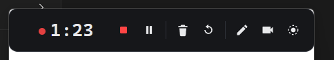
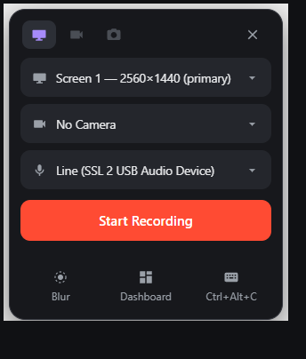

# DragonRecorder

Self-hosted Loom. Record your screen and webcam on Windows, get a share link
on your clipboard **the instant you stop** — before the upload even starts.



*The recording toolbar. You see it; the recording doesn't — it's excluded
from capture via `SetWindowDisplayAffinity(WDA_EXCLUDEFROMCAPTURE)`, so it
stays full-size instead of collapsing like Loom's.*

## The flow



1. **`Ctrl+Alt+C`** opens the launcher, top-right of your screen — pick
   monitor, camera, mic, blur (persisted; it's one click from Start every
   time after).
2. **Start Recording** — 3-second countdown, recording starts. Webcam floats
   as a draggable circle (dragging it mid-recording moves it in the video —
   that's a feature). `Ctrl+Alt+D` toggles draw-on-screen mode; strokes
   fade after ~2 s.
3. **`Ctrl+Alt+C` again** — recording stops and **the share link is
   already on your clipboard** (measured: 0.04 s after stop). Upload runs in
   the background; anyone opening the link mid-upload sees a processing page
   that flips live automatically.
4. Minutes later the same link has a Whisper transcript, an AI title and
   description, a thumbnail, and one-click edits — **remove filler words,
   remove silences, captions** — detected, counted, and applied as
   non-destructive toggles. The original file is never rewritten.

Flubbed the intro? **Trash** kills the take (no link, no upload, slug
released) and **Restart** begins a new one instantly with the same setup.

The player is one dark page: pre-play duration + speed, view-count pill,
emoji reactions, timestamp-pinned comments, click-to-seek transcript — and
once a recording has views, the scrub bar doubles as the viewer-attention
histogram. The dashboard (basicauth) has per-viewer watch analytics,
drop-off charts, inline title editing, and the edit toggles.

## Run the client (Windows)

Requires Windows 10 2004+, Python 3.11+, and an ffmpeg build whose NVENC API
matches your NVIDIA driver (older drivers need ffmpeg ≤7.x — grab a
[BtbN n7.1 build](https://github.com/BtbN/FFmpeg-Builds/releases) and set
`FFMPEG_PATH`). Without NVENC it falls back to gdigrab + x264 automatically.

```
copy .env.example .env    # set SERVER_URL, CAPTURE_TOKEN, FFMPEG_PATH
run.bat
```

`run.bat` (or `run.ps1`) takes no flags: first run creates the venv and
installs dependencies, then it starts the tray app.

AI titles use the `claude` CLI if installed (local subscription, no API
key); otherwise a heuristic title from the transcript's first words.

## Deploy the server

FastAPI + SQLite behind Caddy, shipped as Docker Compose. Caddy serves the
video bytes directly (range requests = scrubbing); the app only handles
metadata, analytics, and lifecycle. 14-day retention with a daily reaper,
a free-disk guard, `/healthz`, and Telegram pings for failures and new views
(your own plays excluded — signing in to `/dash` marks your browser as the
owner). The dashboard has a single-user session login (same scheme as
remote_pc: pbkdf2 password, per-IP lockout, HMAC session cookie).

```
python deploy/deploy.py --ip <box-ip> [--domain rec.example.com]
```

First run generates the capture token and dashboard password and prints
both. See [deploy/](deploy/) for the Caddy site block and
[docs/decisions.md](docs/decisions.md) for the non-obvious design calls
(capture exclusion, clipboard-before-upload, client-side processing,
decision-list edits).

## License

MIT
